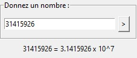

# Python-Scientific-Writing

This is a program that gives the scientific writing of a number that you type.
## Installation
1. Download the repository by clicking on `Code > Download ZIP`
2. Extract the ZIP file
3. Run `main.pyw`
## Requirements
- Python 3.7
- Python `tkinter` library